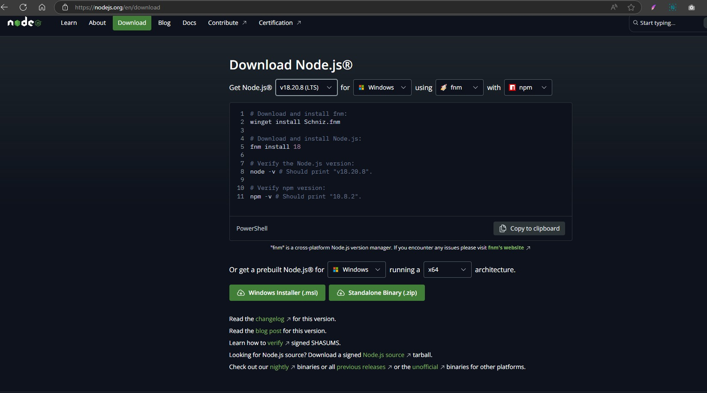
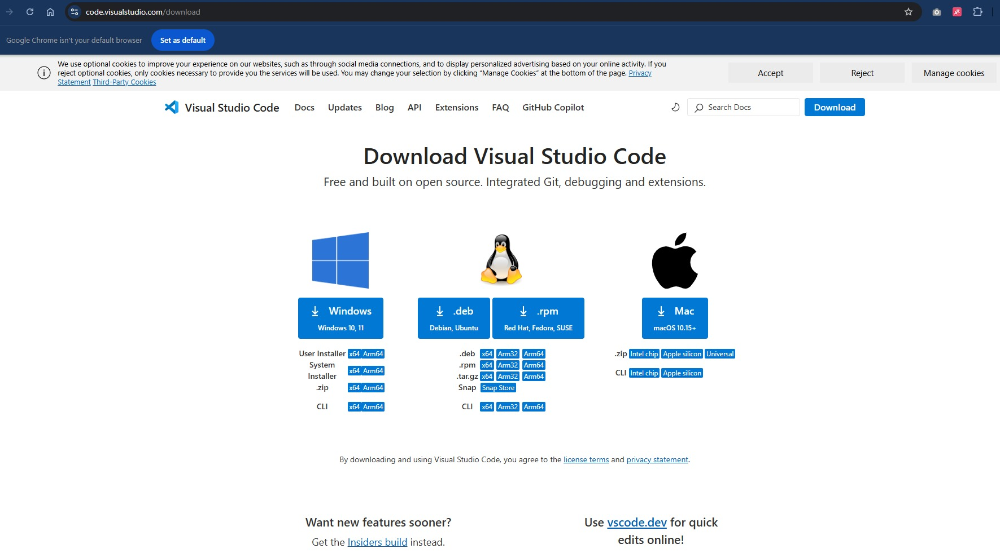

# Abrindo navegador Chrome pela automação do Selenium-webdriver

| Step    | Objetivos                                                                               | Check |
| ------- | -------------------------------------------------------------------------------------   | ------|
|    1    | Instalar IDE (neste exemplo VSCode)                                                     |   ✔   |
|    2    | Instalar Node.js                                                                        |   ✔   |
|    3    | Comandos via terminal na raiz do projeto                                                        |
|    4    |   * npm install selenium-webdriver                                                      |   ✔   |
|    5    |   * npm install chromedriver                                                            |   ✔   |
|    6    | Para rodar no terminal                                                                          |
|    7    |   * node .\nomeArquivo.js    (node .\Driver.js)                                         |   ✔   |

### Main: Logar no WhatsApp e após scannear QRcode manter perfil logado no navegador em questão, mesmo após encerrar a sessão. 

## [Site Node](https://nodejs.org/en/download)

## [Site VSCode](https://code.visualstudio.com/download)

